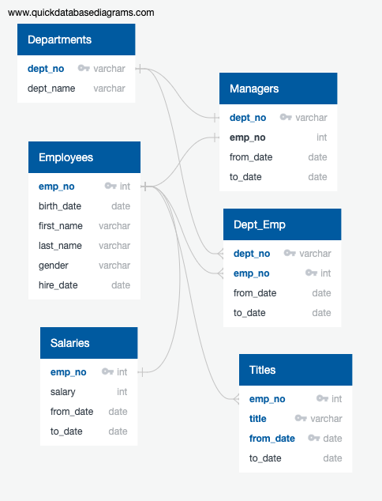

# Pewlett-Hackard-Analysis

## Resources
    - Data Source: employees.csv, departments.csv, dept_emp.csv, dept_manager.csv, salaries.csv, titles.csv
    - Software: pgAdmin 4 v4.23

## Technical Report
### Problem
In this challenge, data across multiple csv files was to be analyzed through SQL pgAdmin4 in order to determine retirement and mentorship eligibility. The issue to overcome is that all the data required for analysis is located in multiple csv files rather than one database. In order to complete the analysis, the data must be able to be analyzed in one interface or database.

### Analysis Procedure
A database containing tables of all the csv files was created in pgAdmin4. This allowed me to gather data across multiple tables for analysis. An entity relationship diagram (ERD) was created in order to determine primary and foreign keys between all of the provided data sets. The image below shows the ERD that was utilized for this analysis.

After understanding the relationship between datasets, analysis was executed by using join methods to combine data across multiple sheets when given certain criteria. the first part of this challenge required me to create a list of retiring employees with their current title and salary included. The criteria for retired employees are as follows;born between 1952 - 1955. When filtering through the data to determine retiring employees, another criteria had to be utilized to confirm that the employee was still employed by the company. Without this extra criteria the analysis would be inaccurate. An inner join between the employees and titles datasets allowed the proper information to be shown in one dataset. However, an issue existed when this process created multiple data entries for employees who have held multiple titles. In order to correct the multiple entries a partition method was used on the newly created table.

For the second part of this challenge, a data table for mentorship eligible candidates was created based on birth date criteria of January 1, 1965 to December 31, 1965. In this analysis, two inner join methods were used to combine employee data, title data, and department employee data. After creating this new data set, it was noticed that there were duplicate values again due to the nature of the inner join method. A partition was once again executed on the data table in order to remove any duplicate entries. 

### Analysis Results
The results for the first deliverable as described above are shown below. This is the number of potential candidates eligible for retirement by title.

    - Assistant Engineer: 251
    - Engineer: 2711
    - Manager: 2
    - Senior Engineer: 13651
    - Senior Staff: 12872
    - Staff: 2022
    - Technique Leader: 1609
  
   **Total: 33118**

Please reference the correct_count_by_title.csv for these results and correct_retire_by_title.csv for a complete list of these employees.

The results for the second deliverable can be found in the Mentorship_Eligible.csv file. This includes a table with **_1549_** employee names and titles that are eligible for the mentorship program. Potentially we can look into the hire date of these employees to determine which have been employed the longest and are determined to be most experienced for the mentorship program.